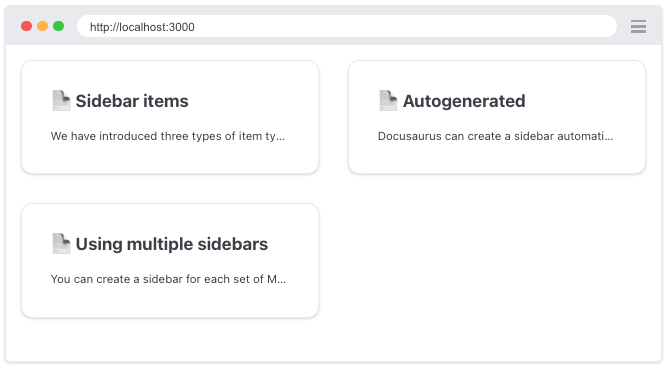

import Tabs from '@theme/Tabs';
import TabItem from '@theme/TabItem';
import DocusaurusLogo from '@site/static/img/docusaurus.png';

# [Docusaurus] 基本用法

檔案結構：
```
website                     # root directory of your site
├── docs
│   ├── my-first-doc.md     # 直接在 docs 底下新增 .md 文件
│   └── categoryName        # 在 docs 底下建立子分類資料夾
│       ├── page1.md        # 在子分類下新增子文件
│       └── page2.md
├── src
│   └── pages
├── docusaurus.config.js
├── ...
```
## 內容
### Blog 文章

在 `/blog` 資料夾中新增 Markdown 文件（`.md` 或 `.mdx`），內容格式如下：

```markdown
---
slug: my-first-post
title: 我的第一篇文章
authors: [你的名字]
tags: [標籤1, 標籤2]
---

這是我的第一篇文章內容。
```

### Docs 文件

在 `/docs` 資料夾中新增 Markdown 文件（`.md` 或 `.mdx`），例如 `intro.md`，內容格式如下：

```markdown
---
id: intro
title: 介紹
---

這是我的筆記介紹。
```

## Sidebar
> [Sidebar](https://docusaurus.io/docs/sidebar)

在文件 metadata 中設定 sidebar 的 label 與 position：

```md title="docs/my-first-doc.md"
---
sidebar_label: "My First Doc" # 文件在 sidebar 的名稱
sidebar_position: 1 # 文件在 sidebar 的位置
---
```

Docusaurus 會根據 `docs` 資料夾結構[自動產生 sidebar](https://docusaurus.io/docs/sidebar/autogenerated)：

```ts title="sidebar.ts"
export default {
  tutorialSidebar: [
    {
      type: 'autogenerated', 
      dirName: '.' // 從 docs 資料夾自動產生 sidebar
    }
  ],
};
```

也可以手動設定 sidebar 的結構：

```ts title="sidebar.ts"
export default {
  tutorialSidebar: [
    'intro',
    'hello',
    {
      type: 'category',
      label: 'Tutorial',
      items: ['tutorial-basics/create-a-document'],
    },
  ],
};
```

:::tip
更複雜的 Sidebar 設置可以參考 Docusaurus 自家網站的配置：https://docusaurus.io/docs/sidebar#complex-sidebars-example
:::

### Sidebar items

> https://docusaurus.io/docs/sidebar/items

Sidebar item 的 **type** 可以分成這幾種：
- **`doc`**：連到 doc 頁面
- **`link`**：連到內部 or 外部的頁面
- **`category`**：可展開的階層式 dropdown
- **`autogenerated`**：自動建立 sidebar items
- **`html`**：渲染 pure HTML
- **`ref`**：連到 doc

#### `DocCardList`

```ts title="docs/dievar/index.md"
import DocCardList from '@theme/DocCardList';

<DocCardList />
```



#### Category item metadata

在 category 資料夾內建立 `_category_.json` 或 `_category_.yml` 設定檔，來設定 sidebar 分類的名稱、描述。

```json title="_category_.json"
{
  "label": "分類 A",
  "position": 2,
  "collapsible": true,
  "collapsed": false,
  "className": "red",
  "link": {
    "type": "generated-index",
    "title": "分類連結的名稱"
    "description": "分類的描述"
  },
  "customProps": {
    description: "This description can be used in the swizzled DocCard"
  }
}
```

- `label`：分類在 sidebar 的名稱
- `position`：分類在 sidebar 的位置
- `link`：為分類建立一個單獨的連結


## Markdown Features

> [Markdown Features](https://docusaurus.io/docs/markdown-features)

### MDX

MDX (Markdown + JSX) 是一種結合了 Markdown 與 JSX 的標記式語言，讓使用者能夠在 Markdown 文件內容中使用 React 元件。Docusaurus 內建的  **[MDX](https://mdxjs.com/)** compiler 會將 Markdown 文件轉換成 React components，因此我們可以在 Markdown 中撰寫 JSX（使用 JavaScript 邏輯與變數、插入 React 元件、將元件和內容模組化⋯⋯等）。

MDX compiler 支援 `.md` 與 `.mdx` 格式。為了一致性，Docusaurus v3 預設將所有檔案（不管是 `.md` 還是 `.mdx` 檔案）視為 **MDX 格式**處理。這樣做的好處是可以：

- 向後相容：即使過去使用了 `.md` 檔案，Docusaurus 也會將其視為 MDX 檔案來處理，以確保使用者可以隨時插入 React 元件。
- 簡化使用者體驗：使用者不必特別區分文件格式，預設會使用 MDX 處理所有 `.md` 和 `.mdx` 檔案。

#### MDX & React Components

在 Markdown 中使用 React components，。

1. 自訂 Highlight 元件 (src/components/Highlight.jsx)

```react
import React from 'react';

export const Highlight = ({children, color}) => (
  <span
    style={{
      backgroundColor: color,
      borderRadius: '20px',
      color: '#fff',
      padding: '0.2rem',
      cursor: 'pointer',
    }}
    onClick={() => {
      alert(`You clicked the color ${color} with label ${children}`)
    }}>
    {children}
  </span>
);


This is <Highlight color="#25c2a0">Docusaurus green</Highlight> !
This is <Highlight color="#1877F2">Facebook blue</Highlight> !
```

2. 在 Markdown 中使用

```markdown
---
title: MDX 互動示範
---

# 這是 MDX 文件

我可以寫 **Markdown** 搭配 *JSX*！

import { Highlight } from '@site/src/components/Highlight';

<Highlight color="#25c2a0">內嵌自訂元件</Highlight>

## Tabs 元件（多語言代碼）
```mdx
import TabItem from '@theme/TabItem';

<Tabs>
<TabItem value="js">```javascript
console.log('Hello MDX!');
```</TabItem>
<TabItem value="py">```python
print("Hello MDX!")
```</TabItem>
</Tabs>

```

#### 內建 MDX 元件

```
- **Admonition**（提示框）：
  > :::tip 提示
  > 這是提示訊息
  > :::

- **Tabs**：多版本內容切換
- **Accordion**：可折疊內容
- **CodeBlock**：互動程式碼區塊
```

### Front Matter

Markdown 文件最上方是 [Front Matter](https://docusaurus.io/docs/markdown-features#front-matter)，以 YAML 格式撰寫、包覆在 `---` 中。用來為 Markdown 文章加上 metadata，來設定文件的標題、標籤(tags)、位置等。

```md title="my-first-doc.md"
---
title: "my-first-doc"									# 文件標題
description: "This is my first doc" 	# 文件描述
tags: [npm, docusaurus]						 	  # 標籤 
slug: /my-first-doc 									# 用來修改文件的 slug url，不寫的話默認為文件名
---
```

## Standard Features

### Links

使用 url path：

```markdown
Let's see how to [Create a page](/create-a-page).
```

或是 relative path：

```markdown
Let's see how to [Create a page](./create-a-page.md).
```

### Images
> [Images](https://docusaurus.io/docs/markdown-features/assets#images)

<Tabs>
  <TabItem value="markdown" label="Markdown syntax" default>
    使用**絕對路徑**：
    ```markdown
    
    ```
    或使用**相對路徑**：
    ```markdown
    
    ```
    
  </TabItem>
    <TabItem value="commonJS" label="CommonJS require" default>
    使用 CommonJS `require` 語句和 JSX image 標籤：
    ```jsx
    
    ```
    
  </TabItem>
  <TabItem value="import" label="Import statement">
  使用 ES `import` 語句和 JSX image 標籤：
    ```jsx
    import DocusaurusLogo from '@site/static/img/docusaurus.png';
    
    
    ```
    
  </TabItem>
</Tabs>

### Code Blocks

#### Title
````markdown
```js title="src/檔案位置/這邊可以放標題"
// your code...
function HelloDocusaurus() {
  return <h1>Hello, Docusaurus!</h1>;
}
```
````
```js title="src/檔案位置/這邊可以放標題"
// your code...
function HelloDocusaurus() {
  return <h1>Hello, Docusaurus!</h1>;
}
```

#### Line Highlighting

##### 方法一：透過註解加上標記 (Highlighting with comments)
在 code block 中透過「註解」的方式來替特定行數畫記重點，這些註解並不會在最後顯示在程式碼區塊中：
- 標記下一行：`// highlight-next-line`
- 標記範圍內的程式碼：`// highlight-start` 與 `// highlight-end`

````markdown
```js
function HighlightNextLine(highlight) {
  if (highlight) {
    // highlight-next-line
    return 'This line is highlighted!';
  }

  return 'Nothing highlighted';
}

function HighlightMultipleLines(highlight) {
  // highlight-start
  if (highlight) {
    return 'This range is highlighted!';
  }
  // highlight-end

  return 'Nothing highlighted';
}
```
````

```js
function HighlightNextLine(highlight) {
  if (highlight) {
    // highlight-next-line
    return 'This line is highlighted!';
  }

  return 'Nothing highlighted';
}

function HighlightMultipleLines(highlight) {
  // highlight-start
  if (highlight) {
    return 'This range is highlighted!';
  }
  // highlight-end

  return 'Nothing highlighted';
}
```

##### 方法二：透過 metadata 加上標記 (Highlighting with metadata string)

在 code block 的語言後加入 metadata string 指定要 highlight 的行數：`<語言> {<metadata string>}`

- 單行（例如 `3`）
- 多行：用逗號 `,` 分隔行號（例如 `1, 3, 5`）
- 範圍：用範圍語法 `-` （例如 `2-4`）

Docusaurus 使用了 **`parse-number-range`** 這個 library 來解析 metadata string 中的行數語法。

````mark
```jsx {1,4-6,11}
import React from 'react';

function MyComponent(props) {
  if (props.isBar) {
    return <div>Bar</div>;
  }

  return <div>Foo</div>;
}

export default MyComponent;
````

```jsx {1,4-6,11}
import React from 'react';

function MyComponent(props) {
  if (props.isBar) {
    return <div>Bar</div>;
  }

  return <div>Foo</div>;
}

export default MyComponent;
````

### 警告／提示區塊 Admonitions
> [Admonitions](https://docusaurus.io/docs/markdown-features#admonitions)

```
:::note
This is a note
:::

:::tip[My tip]
Use this awesome feature option
:::

:::info[My info]
This is an info
:::

:::warning[My warning]
This is a warning
:::

:::danger[Take care]
This action is dangerous
:::
```

:::note
This is a note
:::

:::tip
Use this awesome feature option
:::

:::info
This is an info
:::

:::warning
This is a warning
:::

:::danger
This action is dangerous
:::

## Docs-only mode

> https://docusaurus.io/docs/docs-introduction#docs-only-mode

到 docusaurus.config.js 設定檔 -> presets -> docs 加上 `routeBasePath: '/'` 設定為網站的 root。

```js title="docusaurus.config.js"
export default {
    // ...
    presets: [
        [
            '@docusaurus/preset-classic',
            {
                docs: {
                    routeBasePath: '/', // Serve the docs at the site's root
                    /* other docs plugin options */
                },
                blog: false, // Optional: disable the blog plugin
                // ...
            },
        ],
    ],
};
```
